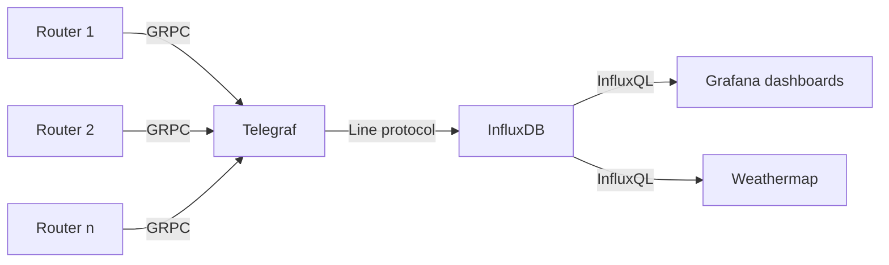
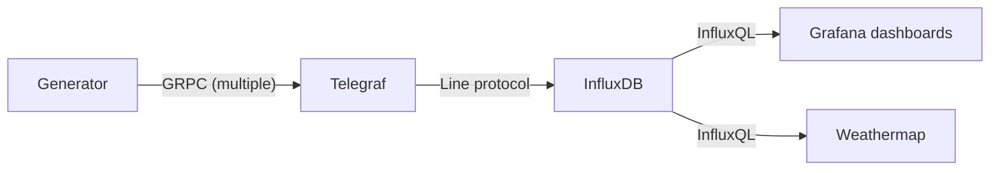

# Streaming Telemetry Workshop

This is the code for the Streaming Telemetry workshop at UETN Tech Summit 2024.

## Project structure
- `generator/` - Metrics generator for the workshop, this mimics a multi-device network with GRPC Streaming Telemetry enabled
  - `generator/cisco_proto/` - Cisco IOS-XE `.proto` files and scripts needed to generate the GRPC protobuf messages. From https://github.com/cisco-ie/cisco-proto/
  - `generator/samples/` - Sample metrics to stream
- `grafana/` - Grafana config files for visualization
- `influxdb/` - InfluxDB config files for the time-series database
- `telegraf/` - Telegraf config files for ingesting metrics
- `docker-compose.yaml` - Docker compose for running this project
- `volatile/` - Temporary/variable files needed for running containers

## Data flow diagram
This is how network metrics typically flow when this project is deployed in an environment with real devices:

In case physical devices aren't reachable, there is a metrics generator that can mimic IOS-XE connections and messages:

## Network configuration
See [docs/NETWORK.md](docs/NETWORK.md) for information about configuring your network devices.

## Running the project
See [docs/WORKSHOP.md](docs/WORKSHOP.md) for instructions on project setup and running the workshop.

## Additional considerations
See [docs/CONSIDERATIONS.md](docs/CONSIDERATIONS) for information about expanding this project to a production environment.

## Notes
This workshop/project is not affiliated with Cisco Systems, Grafana Labs or InfluxData. All trademarks are property of their respective owners.

## Additional links
- [UETN Tech Summit](https://summit.uen.org/)
- [Grafana](https://grafana.com/)
- [InfluxDB](https://www.influxdata.com/products/influxdb/)
- [Telegraf](https://www.influxdata.com/time-series-platform/telegraf/)
- [UEN Weathermap](https://github.com/utahsaint-org/weathermap-ng)
- [Cisco Streaming Telemetry Quick Start Guide](https://developer.cisco.com/docs/ios-xe/streaming-telemetry-quick-start-guide/)